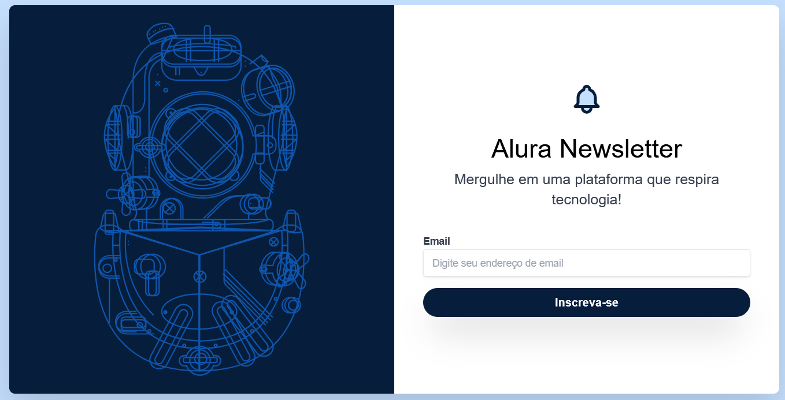

## 📩 Alura Newsletter

O **Alura Newsletter** é uma página simples e responsiva criada para **captura de e-mails**, estilizada completamente com **Tailwind CSS**. A proposta do projeto é explorar o uso de **classes utilitárias**, além de praticar personalizações com tailwind.config e aplicar animações leves e modernas.

 

## 🚀 Sobre o Projeto

Este projeto foi desenvolvido durante o curso da Alura:

* "Tailwind CSS: estilizando a sua página com classes utilitárias"

A página possui uma interface direta e moderna, com uma imagem e um campo para **inserção de e-mail** com foco na usabilidade e experiência do usuário. Utiliza **Tailwind CSS** para estilização, aproveitando o poder das **classes utilitárias** para construir a interface de forma ágil e personalizada.

## 📚 Objetivos do Curso

* Construir um projeto utilizando **Tailwind CSS**;
* Identificar quais as principais diferenças entre o **Bootstrap e o Tailwind CSS**;
* Implementar customizações no projeto com o tailwind.config;
* Modificar o alinhamento e posicionamento dos elementos;
* Experimentar estilizar elementos com o uso das classes utilitárias;
* Produzir uma **animação do zero** para a Alura Newsletter.

## 🛠️ Tecnologias Utilizadas

## 🖼️ Visualização do Projeto

Uma prévia das principais funcionalidades do **Alura Newsletter**:

**🌐 Acesse o Projeto Online**

O projeto está disponível para visualização na **Vercel**. Clique no link abaixo para acessar:

**📨 Página de Captura**

Seção com imagem ilustrativa, texto de convite e formulário de e-mail com animação.

